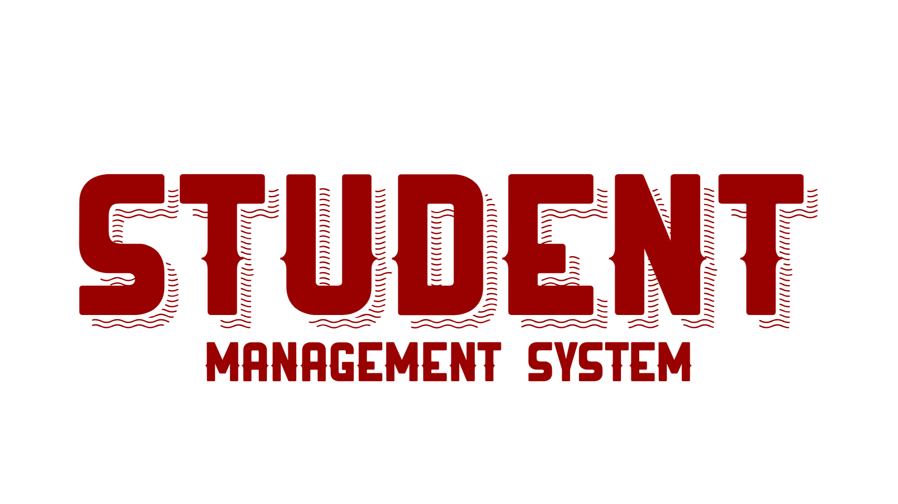
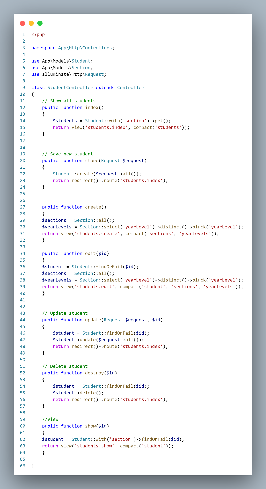

<p align="center">
  


</p>

---

## 🧾 Overview
The **Student Management System** is a web-based application built with **Laravel**, designed to help efficiently manage student and section records.  
It provides a simple interface for adding, updating, viewing, and deleting student data — demonstrating CRUD functionalities (Create, Read, Update, Delete).

---

## 🎯 Objectives
- Understand the fundamentals of database-driven web applications.  
- Implement CRUD operations using Laravel and MySQL.  
- Develop a responsive and user-friendly interface.  
- Demonstrate project collaboration through Git and GitHub.  
- Provide an efficient solution for managing academic records.

---

## ✨ Features / Functionality
| Feature | Description |
|----------|--------------|
| 🧍 Student Registration | Add, update, and manage student details. |
| 🏫 Section Management | Create and organize class sections. |
| 🔁 CRUD Operations | Full Create, Read, Update, and Delete support. |
| 📱 Responsive Design | Accessible via desktop and mobile browsers. |
| 🔍 Search & Display | Quickly view and filter students and sections. |
| 🌍 Git Integration | Version control with GitHub collaboration. |

---

## ⚙️ Installation Instructions

##### 1. Clone the repository
```bash
git clone https://github.com/DarleneGarcia/midterm-project.git
```

##### 2. Go to the project folder
```bash
cd midterm-project
```

##### 3. Install dependencies
```bash
composer install
npm install
```

##### 4. Copy environment file
```bash
cp .env.example .env
```

##### 5. Generate app key
```bash
php artisan key:generate
```

##### 6. Set up database credentials in .env

##### 7. Run migrations
```bash
php artisan migrate
```

##### 8. Start the server
```bash
php artisan serve
Visit the system at http://127.0.0.1:8000
```
---

## 🪄 Usage
1. Launch the system in your browser.
2. Navigate between Students and Sections.
3. Add or edit student details.
4. View and manage records in the table.
5. Delete or update entries as needed.

---

## 💻 Code Example


---

## 👩‍💻 Contributor
- Darlene Garcia

---

## 📜 License
This project is for educational purposes only and intended for learning and academic use.
